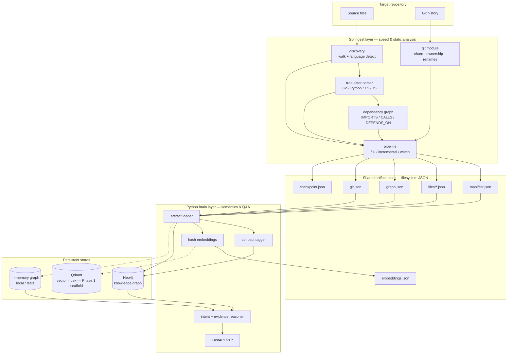
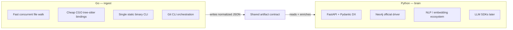
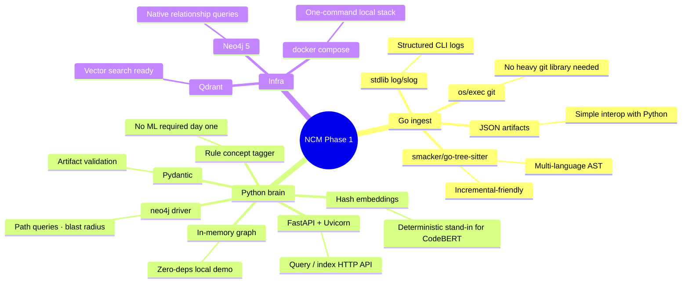
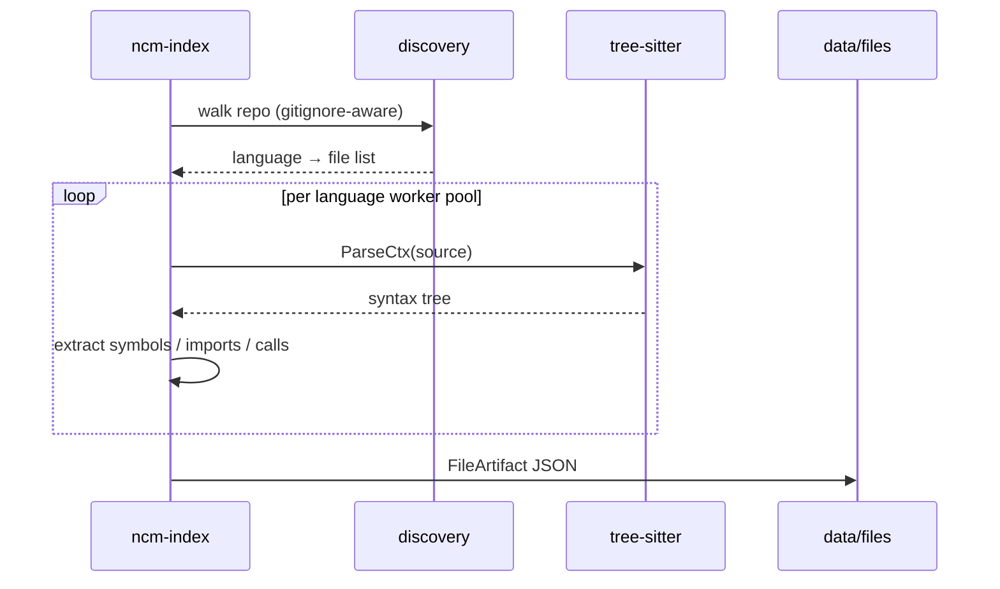
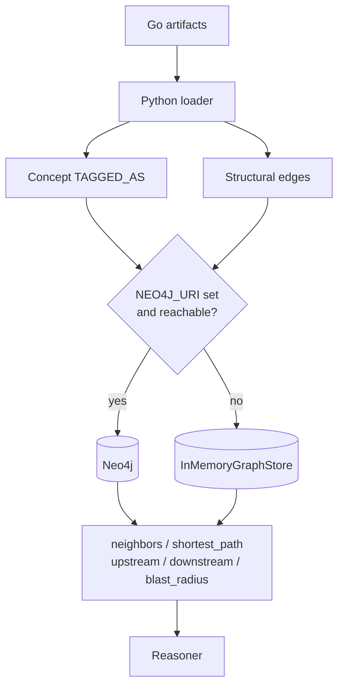
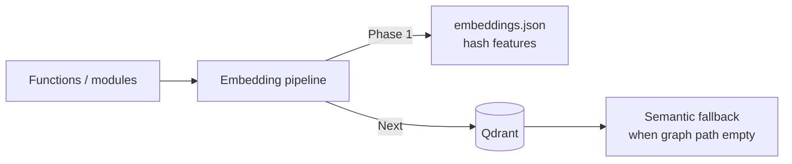
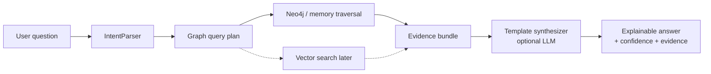

# NCM Architecture & Technology Choices

This document explains **which technologies NCM uses**, **where they sit in the pipeline**, and **why they were chosen** for Phase 1.

## System overview



## Why a hybrid Go + Python stack?



| Side | Responsibility | Why this language |
|------|----------------|-------------------|
| **Go** | Discover, parse AST, build structural graph, git history, incremental index | Throughput, easy CLI distribution, mature tree-sitter Go bindings |
| **Python** | Load artifacts, concept tags, graph queries, reasoning, HTTP API | Best ecosystem for Neo4j, embeddings, and LLM synthesis |

The boundary is deliberate: **Go never talks to Neo4j**; **Python never re-parses the whole tree**. They meet on disk via JSON (+ Protobuf schemas for the long-term contract).

---

## Technology map (what / where / why)



### Detailed rationale

| Tech / lib | Layer | Role today | Why this choice | Alternatives considered |
|------------|-------|------------|-----------------|-------------------------|
| **Go 1.23** | Ingest CLI | Indexer binary | Fast concurrency, static binary | Rust (steeper), Node (slower AST) |
| **[tree-sitter](https://tree-sitter.github.io/)** via `smacker/go-tree-sitter` | Parser | Extract functions, imports, calls for Go/Python/TS/JS | Incremental, multi-language, battle-tested grammars | `go/ast` only (Go-only), Roslyn/ts-morph (polyglot pain) |
| **`log/slog`** | Go logging | Structured progress / errors | Stdlib since 1.21, JSON or text | zap/zerolog (extra deps for Phase 1) |
| **Git CLI (`os/exec`)** | History | Commits, churn, ownership, renames | Ubiquitous, rename detection with `-M` | go-git (heavier, rename quirks) |
| **Filesystem JSON** | Artifact store | Manifest, per-file AST, graph, git, checkpoint | Debuggable, language-agnostic | gRPC-only (harder to inspect), S3 later |
| **Protobuf schemas** (`schema/`) | Contract | Shared entity/event shapes | Forward-compatible Go↔Python IDL | JSON Schema alone (we keep both) |
| **Python 3.12+** | Brain | Semantics + API | Ecosystem fit | Stay Go-only (weaker LLM/embedding story) |
| **FastAPI + Uvicorn** | API | `/v1/query`, `/v1/index`, graph path | Async-friendly, OpenAPI free | Flask (less structure), gRPC (worse curl DX) |
| **Pydantic v2** | Validation | Artifact models | Matches FastAPI, catches schema drift | dataclasses (weaker validation) |
| **Neo4j 5** | Graph DB | CONTAINS / DEPENDS_ON / TAGGED_AS / OWNS paths | Native path queries + explainability | Kùzu (embedded alternative), Postgres recursive CTEs |
| **In-memory graph** | Graph DB fallback | Same query surface without Docker | Tests + laptop demos | Always require Neo4j (worse DX) |
| **Qdrant** | Vector DB | Scaffolded in compose; embeddings JSON today | Purpose-built ANN, simple Docker image | pgvector (needs Postgres), FAISS (ops heavier) |
| **Hash / feature embeddings** | Embeddings | Deterministic 64-d vectors → `embeddings.json` | No GPU / model download for Phase 1 | sentence-transformers / CodeBERT (next) |
| **Rule + import concept tagger** | Concepts | `auth`, `persistence`, `protocol`, … | Explainable, no training data | Pure LLM tagging (cost + hallucination) |
| **Template reasoner (+ optional OpenAI)** | Reasoning | Intent → graph evidence → answer | Evidence-first; LLM optional | LLM-only RAG (weaker architecture answers) |
| **docker compose** | Local ops | Neo4j + Qdrant | Matches Phase 1 “simple deploy” | k8s (overkill) |

---

## Data flow by concern

### 1. Parsing (tree-sitter)



**Why tree-sitter?** One API for Go, Python, and TypeScript; error-tolerant on incomplete files; fast enough to re-parse only changed files on incremental runs.

### 2. Knowledge graph (Neo4j vs memory)



**Why Neo4j?** Architectural questions are relationship questions (“what depends on X?”, “blast radius if Y deleted?”). Property graphs + Cypher path queries map cleanly to evidence bundles.

**Why keep in-memory?** Same interface for CI and `python -m brain.ingest --memory` without Docker.

### 3. Vectors (Qdrant — scaffold)



**Why Qdrant in compose now?** Reserve the operational slot for concept/function similarity search without forcing model downloads on day one. Phase 1 already writes local embeddings so the contract exists.

### 4. Query path



---

## Logging

| Layer | Mechanism | Controls |
|-------|-----------|----------|
| Go indexer | `log/slog` via `internal/logging` | `NCM_LOG_LEVEL`, `NCM_LOG_FORMAT=json\|text`, `--verbose` |
| Python brain | stdlib `logging` via `brain.logging_config` | `NCM_LOG_LEVEL`, `NCM_LOG_FORMAT`, `--verbose` on ingest |

Example:

```bash
NCM_LOG_LEVEL=debug ./ncm full --repo ../redis-scratch-go --out ./data
NCM_LOG_LEVEL=debug PYTHONPATH=. python -m brain.ingest --data ./data --memory --verbose
```

---

## What is intentionally *not* in Phase 1

| Deferred | Reason |
|----------|--------|
| GNN coupling models | Needs mature graph + labels first |
| Runtime traces / logs | Separate telemetry ingest |
| Cross-repo org memory | Single-repo scope |
| Full CodeBERT / nomic embed in default path | Keep laptop-friendly; Qdrant ready when enabled |
| Always-on Neo4j requirement | In-memory fallback for DX |

---

## Quick mental model

> **Go turns a repo into facts.**  
> **Python turns facts into a graph and answers.**  
> **Neo4j stores relationships; Qdrant will store similarity; JSON is the bridge.**
